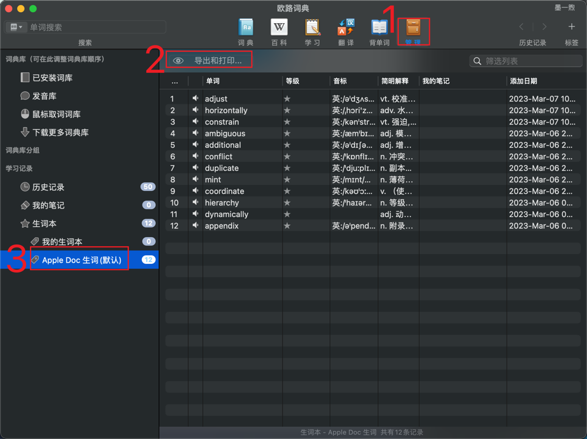
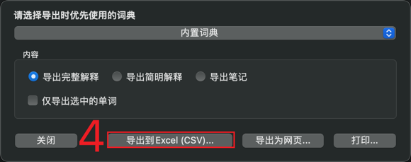

## 项目介绍

这是一个可以实现自动将 [eudic](https://www.eudic.net/v4/en/app/eudic) 的生词本导入到 [qwerty learner](https://github.com/Kaiyiwing/qwerty-learner) 的脚本

## 使用方法

1. 把 qwerty-learner 项目和本项目下载到本地，并运行起来
   ```shell
   # 克隆 qwerty-learner 项目
   git clone https://github.com/Kaiyiwing/qwerty-learner
   # 进入 qwerty-learner 项目目录
   cd qwerty-learner
   # 克隆本项目
   git clone https://github.com/HuberWong/transformer-for-qwerty
   ```

1. 从 eudic 导出 .csv 格式的生词，执行步骤如下：


得到 一个名字类似 `我的学习记录_Mar 6, 2023.csv` 的文件，

2. 将生成的 `我的学习记录_Mar 6, 2023.csv` 文件移动到本项目的 `csvfile_from_eudic` 目录下
3. 执行 `main.py` 脚本
   ```shell
   # 进入本项目目录
   cd transformer-for-qwerty
   # 执行自动导入自己生词本的脚本
   python3 main.py
   ```